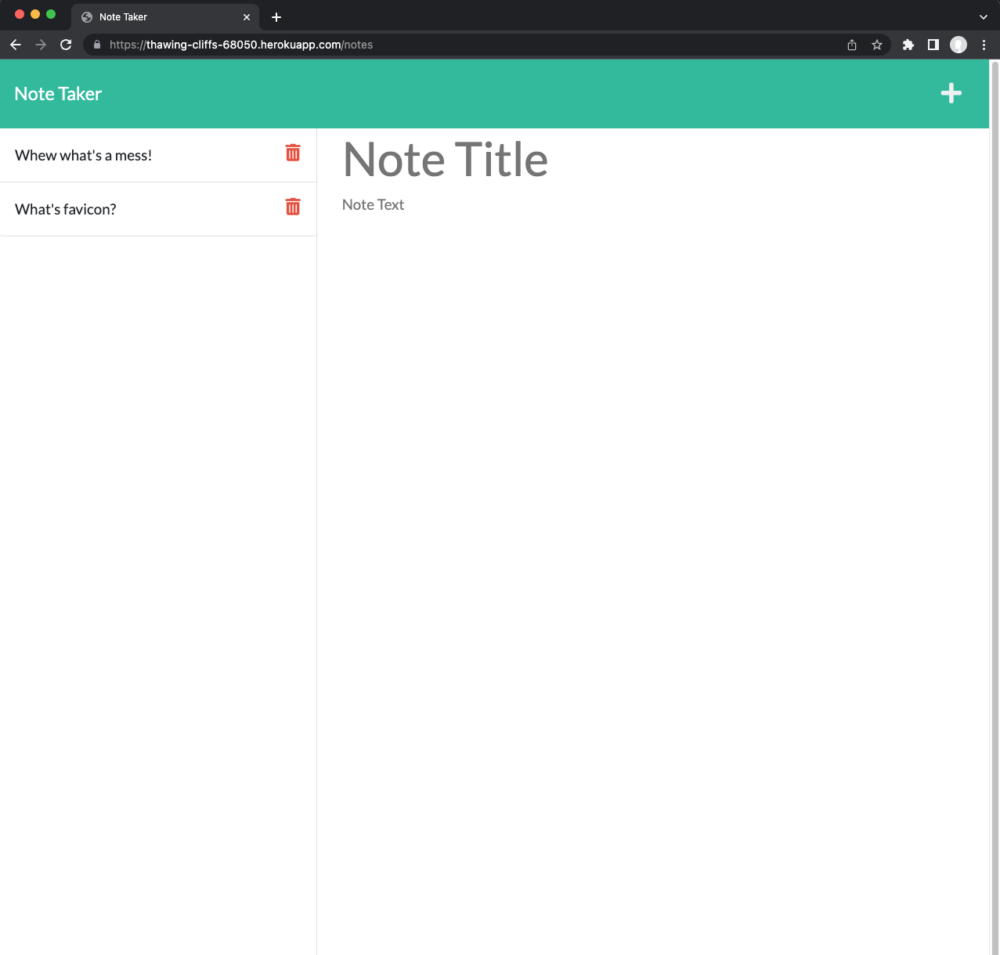

# note-taker
## Description
Web application using Express.js backend and will save and retrieve notes from a JSON file. It is allow you to delete your note.

## Table of Contents
* [Description](#Description)
* [Installation](#Installation)
* [Usage](#Usage)
* [Contributing](#Contributing)
* [Questions](#Questions)
* [License](#License)

## Installation 
Requires the npm express and Generate Unique ID  packages:
```bash
npm i express
npm i generate-unique-id --save
```
## Usage
Note-Taker is currently deployed with [Heroku](https://thawing-cliffs-68050.herokuapp.com/)

1. Click `Get Started` button in Heroku
2. Click `+` in the upper right to add a new note
3. Enter note title and text then click save icon to save your note.
4. Saved notes will appear in left column and click one of saved notes list to view your note.
5. Click the trash can icon next to any saved note to delete your note.



## Contributing
1. Fork this repository
2. Create a new branch
3. Commit changes on your branch
4. Push your changes
5. Create a new pull request
## Questions
If you have any question or would like to report the issues in this project, please feel free to contact me at email_to_be_annouced@domain.com

## License 
This project is license under the [MIT](./LICENSE)

&copy; 2022 Joseph Lara